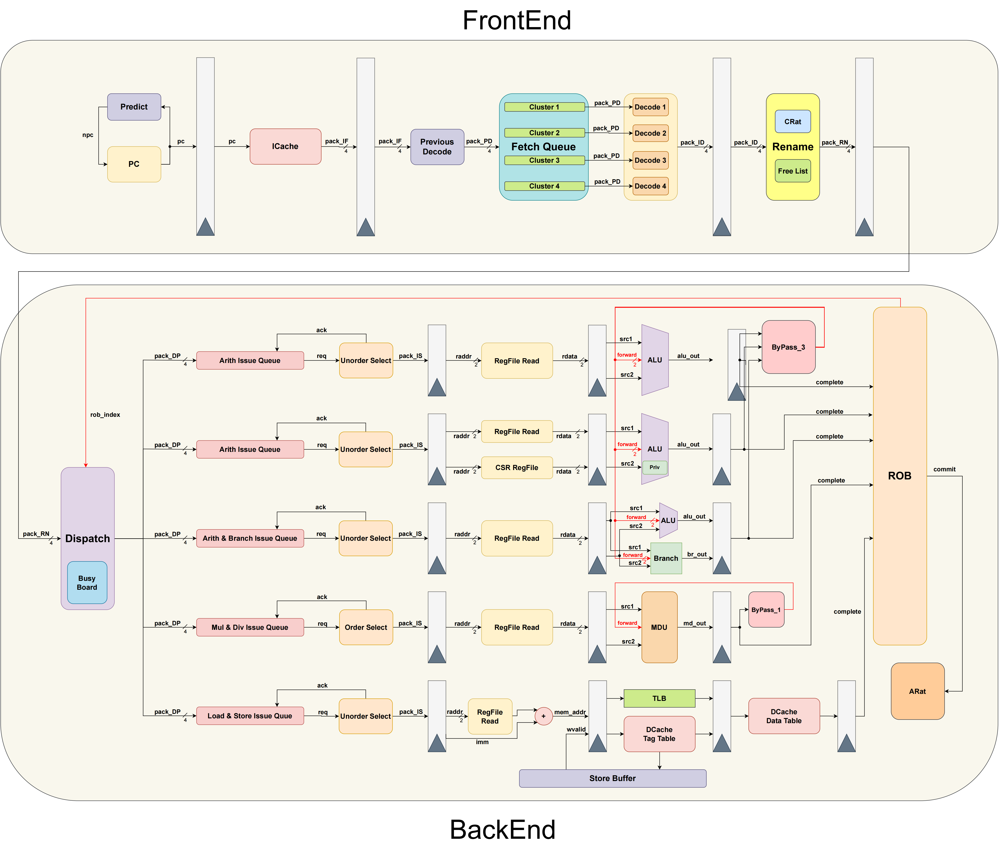

# 基于龙芯架构32位精简版指令集的乱序处理器设计

本项目是2024届中国科大计算机科学与技术学院本科毕业设计项目，由中国科学技术大学计算机科学与技术学院计算机实验中心、中国科学院计算技术研究所提供指导。

## 项目简介

本项目使用Scala的Chisel硬件描述语言，基于龙芯架构32位精简版指令集，设计了一个五发射乱序处理器。该处理器采用了顺序取指、乱序执行、顺序写回的流水线结构。



该流水线当前支持的指令有：

- 算数运算类指令：`ADD.W`, `SUB.W`, `ADDI.W`, `LU12I.W`, `SLT[U]`, `SLT[U]I`, `PCADDU12I`, `AND`, `OR`, `NOR`, `XOR`, `ANDI`, `ORI`, `XORI`, `MUL.W`, `MULH.W[U]`, `DIV.W[U]`, `MOD.W[U]`
- 移位运算类指令：`SLL.W`, `SRL.W`, `SRA.W`, `SLLI.W`, `SRLI.W`, `SRAI.W`
- 转移指令：`BEQ`, `BNE`, `BLT[U]`, `BGE[U]`, `B`, `BL`, `JIRL`
- 普通访存指令：`LD.B`, `LD.H`, `LD.W`, `LD.BU`, `LD.HU`, `ST.B`, `ST.H`, `ST.W`
- CSR访问指令：`CSRRD`, `CSRWR`, `CSRXCHG`

计划实现的其他指令有：

* 非特权架构：

    - 普通访存指令：`PRELD`
    - 原子访存指令：`LL.W`, `SC.W`
    - 栅障指令：`DBAR`, `IBAR`
    - 其他杂项指令：`SYSCALL`, `BREAK`, `RDCNTVL.W`, `RDCNTVH.W`, `RDCNTID`

* 特权架构：
  
    - Cache维护指令：`CACOP`
    - TLB维护指令：`TLBSRCH`, `TLBRD`, `TLBWR`, `TLBFILL`, `INVTLB`
    - 其他杂项指令：`ERTN`, `IDLE`

## 构建方式

本项目使用sbt和java进行构建并生成可综合的verilog代码，使用方法如下：

* 基于仿真进行构建：

    ```bash
    # 进入项目根目录
    make
    ```

* 基于综合进行构建：

    ```bash
    # 进入项目根目录
    make MODE=sync
    ```
## 指导教师
* 卢建良
* 叶笑春

